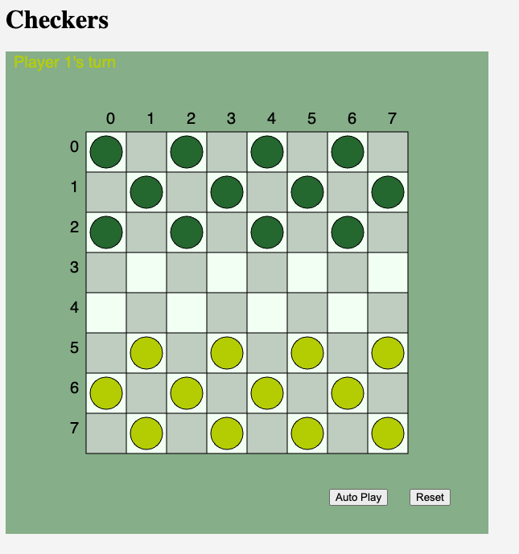

I was bored and decided to make a checkers game in javascript.
I'm sure there are better ways to do this, but it works... I think.

It's a simplified version of checkers, with no king pieces and pieces can move backwards.

[Play Here](https://arturalkaim.github.io/damas/)

https://github.com/arturalkaim/damas/assets/3816823/6a84696e-0d42-4459-ae80-ab61bc88e1c9

